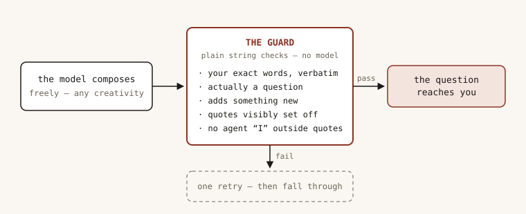
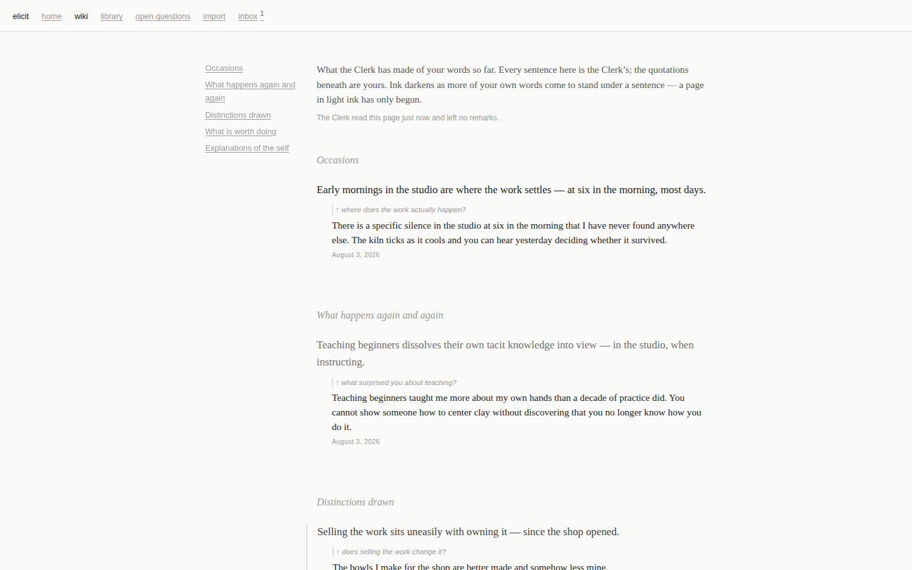
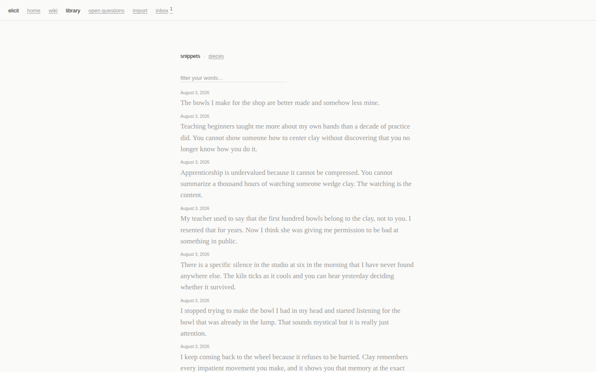
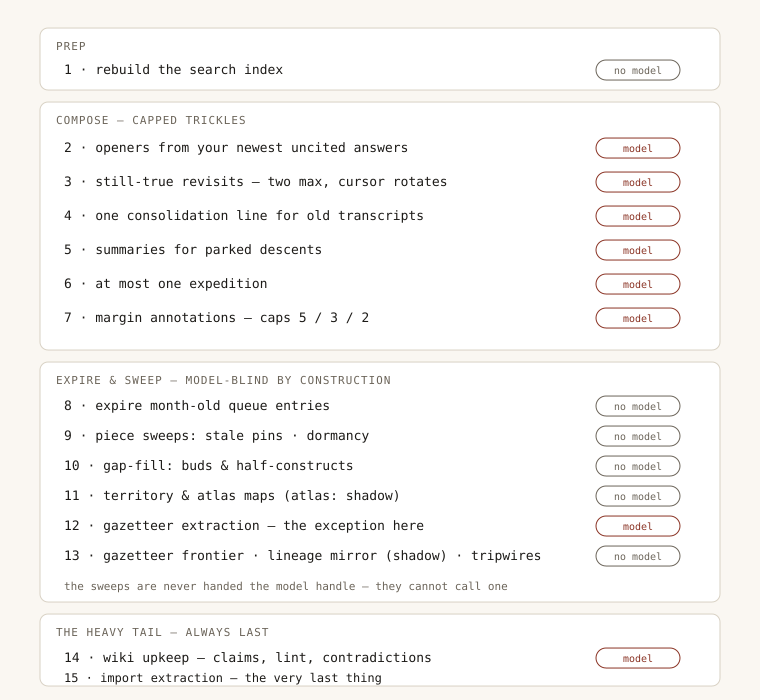

# Elicit

An interviewer that lives on your machine and builds a wiki of what you
think — out of nothing but your own words.


AI notes tools drift toward the model writing your notes: summaries that
smooth over your contradictions, claims you never quite said, errors that
compound with every rewrite. Elicit forbids the model to write. It asks
questions, selects excerpts, and annotates the margins — but every word it
saves is one you typed, checked in code as an exact substring of what you
submitted. If the model rewords a single word, the excerpt is dropped
before it reaches disk.

This is the shape everywhere the model generates anything: it composes
freely, then a mechanical guard — plain string checks, no model — decides
if the result is allowed out. The guard can only reject, never fix.



## A session

You say how much time and energy you have. Elicit asks one quiet question,
on a page that looks like a focus-mode writing app. You write, or dictate.
It follows up with your own phrases — "what kind of *holding*?" — never a
paraphrase.


When you stop, it proposes excerpts worth keeping. You approve, trim, or
discard each one. Approved excerpts become dated markdown files that
nothing will ever edit again.


Between sessions, Elicit re-reads your archive and maintains the wiki:
short claims about what you believe and know, each citing the exact words
it rests on. It also prepares your next questions. Old answers return —
matched on repeated phrasing and, through a local embedding index, on
meaning — so the belief you re-state in fresh words comes back too. And
when today's answer contradicts something you wrote months ago, both
quotes appear side by side, dated. Elicit asks about the tension. It never
resolves it; only you do.



Out of this fall the things you keep: a wiki you can read as an essay
about yourself, and pieces — essays assembled from your own past
sentences, in your order, with no generated filler.



More screens, including the phone-width layout, are in
[`docs/guide/`](docs/guide/).

## Try it in two minutes

Requires Node ≥ 20. No model needed:

```bash
git clone https://github.com/micahchoo/elicit.git && cd elicit
npm install
npm run dev
# open http://127.0.0.1:4517 — scripted interviewer, real everything else
```

## Run it with real models

All inference is local — no hosted API, ever
([why](docs/adr/0001-local-models-only.md)). Under the hood, Elicit is an
agent built on [pi](https://github.com/badlogic/pi-mono)
(`@mariozechner/pi-ai`); it talks to any OpenAI-compatible server
(llama.cpp, Ollama, LM Studio). Elicit uses two model roles: a fast
one for the live interview, where you are waiting, and a careful one for
background work, where nobody is. Point each role at an endpoint — or both
at the same one:

```bash
export ELICIT_LLM_BASE_URL="http://127.0.0.1:8088/v1"     # interview
export ELICIT_LLM_MODEL="bonsai-27b"
export ELICIT_CLERK_BASE_URL="http://127.0.0.1:11434/v1"  # background
export ELICIT_CLERK_MODEL="gemma4:e4b"

npm start
# open http://127.0.0.1:4517
```

On first run, set a password from the host machine; it is scrypt-hashed
into the archive, and there is no password environment variable. To use
Elicit from your phone, bind to the network — setup stays host-only:

```bash
ELICIT_HOST=0.0.0.0 npm start
```

<details>
<summary>All configuration variables</summary>

| Variable | Default | What it does |
|---|---|---|
| `ELICIT_LLM` | `fake` | `local` = real models; `fake` = scripted responses for development |
| `ELICIT_LLM_BASE_URL` | `http://127.0.0.1:8088/v1` | Endpoint for the live-interview model |
| `ELICIT_LLM_MODEL` | `bonsai-27b` | Model id for the live interview |
| `ELICIT_CLERK_BASE_URL` | `http://127.0.0.1:11434/v1` | Endpoint for the background model |
| `ELICIT_CLERK_MODEL` | `gemma4:e4b` | Model id for background work |
| `ELICIT_VAULT_ROOT` | `./vault` | Where your archive lives |
| `ELICIT_HOST` | `127.0.0.1` | Bind address; `0.0.0.0` for network access |
| `ELICIT_PORT` | `4517` | Server port |
| `ELICIT_STT_MODEL_DIR` | _auto-detected_ | Directory with voice-model files |

Any of these can also go in a `.env` file next to the server — see `.env`.
Real environment variables always win over the file, and a value starting
with `~/` expands to the home directory.

Opener questions live in `data/question-bank.jsonl`; grow the file and
restart.

</details>

<details>
<summary>Voice input (optional, ~600 MB)</summary>

Dictation runs [Parakeet](https://huggingface.co/csukuangfj/sherpa-onnx-nemo-parakeet-tdt-0.6b-v3-int8)
in-process on your CPU via [sherpa-onnx](https://github.com/k2-fsa/sherpa-onnx) —
speech never leaves your machine, and you correct the transcript before it
counts. Install the model files:

```bash
huggingface-cli download csukuangfj/sherpa-onnx-nemo-parakeet-tdt-0.6b-v3-int8 \
  --local-dir ~/.cache/elicit/models/sherpa-onnx-nemo-parakeet-tdt-0.6b-v3-int8
```

Or set `ELICIT_STT_MODEL_DIR` (in the shell or in `.env`) to any directory
containing `encoder.int8.onnx`, `decoder.int8.onnx`, `joiner.int8.onnx`,
and `tokens.txt`. Without the files, the mic simply is not offered.

</details>

## Your words stay yours

The archive — Elicit calls it the vault — is plain markdown with
frontmatter, readable in any editor:

```
vault/
  snippets/<id>/v1.md        your words, verbatim, dated, never edited again
  transcripts/<session>.md   full record of each session, append-only
  wiki/                      the app's claims, each citing your exact words
  queue/<id>.md              questions waiting for you
  marginalia/                the app's margin notes
  pieces/                    essays assembled from your own sentences
  imports/                   past writing you brought in
  log/                       what the app did, and when
  index/                     derived and rebuildable — safe to delete
```

The vault is its own git repository, committed by the app under its own
name (`elicit-clerk`) after each background run — so a hand edit and an app
write are distinguishable in `git log`.

One honest limit: the guarantee is about wording, not origin. Paste in
someone else's sentence and Elicit files it as yours. You can declare what
you imported; the app never tries to detect it.

## Status

Early, personal software — expect movement. Everything above works end to
end against local models: the interview loop, the returning memory, the
background wiki upkeep, contradiction detection, essay composition, bulk
import of past writing, and structured interview formats borrowed from
knowledge-elicitation research. Multi-step deep-dive questioning is
landing now.

## Going deeper

The domain model was designed by extended interrogation before code, and
the research is checked in: [`CONTEXT.md`](CONTEXT.md) is the glossary,
[`docs/decisions/elicit.md`](docs/decisions/elicit.md) the register of 78
design decisions, [`docs/adr/`](docs/adr/) the architecture decisions, and
[`docs/interface-references.md`](docs/interface-references.md) the design
stance behind the text-only interface. Three research files at the repo
root cover modeling a person from their own words, question policy, and
how LLM-maintained knowledge bases fail.

All the background work happens in one fixed pass, the docket: capped
composing trickles first, then sweeps that are model-blind by
construction — they are never handed the model handle — and the heavy
tail always last, so the trickles never wait on it:



```bash
npm test     # vitest — the invariants live here
npm run dev  # fake model, watch mode
```

The tests are the contract: exact-substring enforcement, immutable
versions, append-only transcripts. If you change behavior, a failing
invariant test is the design telling you no.

## License

[MIT](LICENSE).
