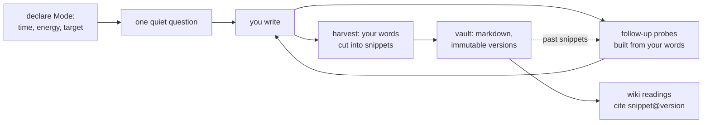

# Elicit

An interviewer that lives on your machine, asks you questions, and builds a
**human-shaped wiki** — a model of your beliefs, contradictions, knowledge, and
craft — out of nothing but your own verbatim words. Writing essays is one thing
that falls out of it. So is finding out what you actually think.

Every word in the corpus is yours. The agent contributes questions, placement,
and margin notes — never prose. That is not a style choice; it is the
architecture.

## Why this exists

Tools where an LLM writes and maintains a knowledge base share four failure
modes: the model smooths over contradictions until errors become internally
consistent; it synthesizes without citing; wrong claims become priors that
future generations build on; and when a contradiction is detected, nothing says
who resolves it. Elicit is the disciplined inverse of that pattern — the model
maintains what *you* wrote, because the act of writing is load-bearing:

| Failure mode | Elicit's answer, by construction |
|---|---|
| Smoothing / false coherence | Contradictions are first-class records, typed (real tension vs. "you changed"), never silently resolved |
| Uncited synthesis | Every wiki claim cites `snippet@version`; every snippet is a verbatim, code-verified substring of what you typed |
| Persistent errors | Snippet versions are immutable; transcripts are append-only; your edits are protected from the agent |
| No resolution authority | Only elicitation resolves — the agent may ask, never decide |

And one more, for a tool this personal: **everything runs locally** — a
llama.cpp/Ollama box on your LAN, no hosted API, ever.

## How a sitting works



You open the app, say how much time and energy you have, and answer one
question at a time on a page that looks like a focus-mode markdown editor.
The agent probes with your own phrases ("what kind of *holding*?"), never
paraphrasing. When you harvest, it proposes cuts — exact substrings of what
you typed, checked in code; anything the model fabricates is dropped, never
patched. Approved cuts become dated, immutable snippets on disk, each with an
agent-written reading (what kind of person-knowledge it evidences) that lives
in the wiki layer, never inside your files.

Sessions build on each other: past snippets return as openers, and when what
you say today clashes with what you wrote in March, both quotes come back
side by side as a question.

## Status

Early and moving. The interview loop (slice 1) works end to end against a
local model. Slice 2 — resonance with your past snippets, a durable question
queue, a background clerk, domain interviews, the activity log — is in
progress. The design is unusually well documented for the size of the code;
see [Design docs](#design-docs).

## Run it

Requirements: Node ≥ 20, and an OpenAI-compatible local model server
(llama.cpp, Ollama, LM Studio) reachable from this machine.

```bash
git clone <this-repo> elicit && cd elicit
npm install
npm run build

# point it at your model server (defaults shown)
export ELICIT_LLM_BASE_URL="http://192.168.0.229:8088/v1"
export ELICIT_LLM_MODEL="bonsai-27b"

ELICIT_LLM=local npx tsx src/server.ts
# open http://127.0.0.1:4517
```

For UI development with hot reload:

```bash
npm run dev:server    # tsx watch — restarts on src changes
npm run dev:web       # vite dev server with HMR at :5173, /api proxied
```

> [!NOTE]
> A server restart drops the in-memory session, but every turn you completed
> is already on disk — transcripts are append-only.

## Configuration

| Variable | Default | What it does |
|---|---|---|
| `ELICIT_LLM` | `fake` | `local` = real model; `fake` = scripted responses for development |
| `ELICIT_LLM_BASE_URL` | `http://192.168.0.229:8088/v1` | OpenAI-compatible chat endpoint |
| `ELICIT_LLM_MODEL` | `bonsai-27b` | Model id at that endpoint |
| `ELICIT_VAULT_ROOT` | `./vault` | Where your corpus lives — plain markdown, portable, yours |

The question bank lives in `data/question-bank.jsonl` — curated opener
questions with provenance (mine are harvested from are.na channels via
`scripts/arena-question-bank.ts`). Grow it; the app picks up changes on
restart.

## The vault is yours

Everything persistent is markdown with frontmatter, readable without this
tool:

```
vault/
  snippets/<id>/v1.md     your words, verbatim, with provenance
  transcripts/<session>.md  append-only exchange records
  wiki/readings/<id>.md   agent readings, citing snippet@version
  buds/<id>.md            fragments not yet standalone, with their questions
  queue/<id>.md           pending questions (slice 2)
```

If Elicit disappears tomorrow, your corpus opens in any editor. That is a
design requirement, not an accident.

## Design docs

The domain model was designed by extended interrogation before code, and the
research is checked in:

- [`CONTEXT.md`](CONTEXT.md) — the glossary: every term, explicitly decided
- [`docs/decisions/elicit.md`](docs/decisions/elicit.md) — Q-1..Q-23, the
  constraint register every plan cites
- [`research-shape-of-the-problem.md`](research-shape-of-the-problem.md) —
  nine literatures on modeling a person from their own words
- [`research-question-policy.md`](research-question-policy.md) — ten
  literatures on which question to ask next, and when not to ask
- [`research-llm-wiki-gist.md`](research-llm-wiki-gist.md) — the LLM-wiki
  pattern's failure modes, mined from ~500 comments
- [`docs/backlog.md`](docs/backlog.md) — adopted mechanisms staged by slice
- [`docs/interface-references.md`](docs/interface-references.md) — the
  focus-friendly editor lineage the UI answers to

## Development

```bash
npm test              # vitest — the invariants live here
npx tsc --noEmit      # strict, exactOptionalPropertyTypes on
```

The tests are the contract: verbatim-substring enforcement, immutable
versions, append-only transcripts, no facet/stance keys in snippet files.
If you change behavior, a failing invariant test is the design telling you no.

## License

Not yet chosen — this is currently a personal tool. If you want to build on
it, open an issue first.
