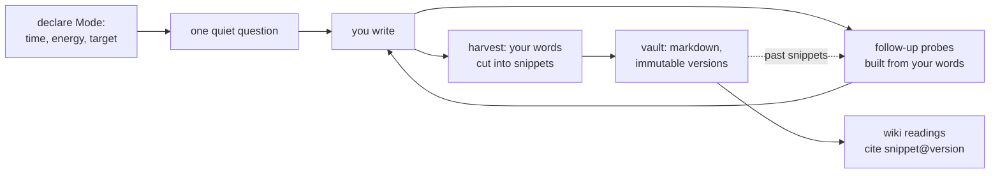
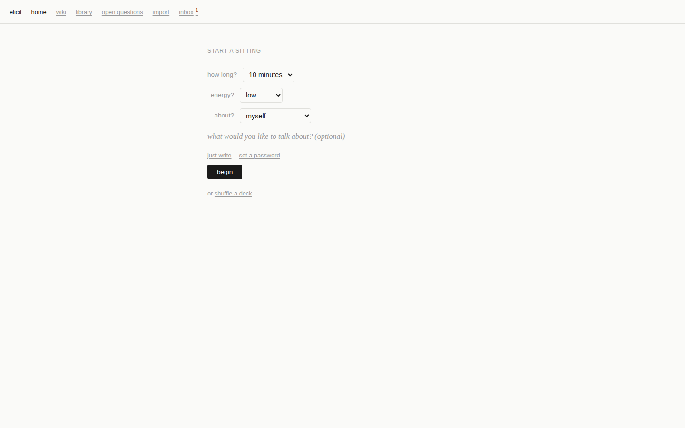
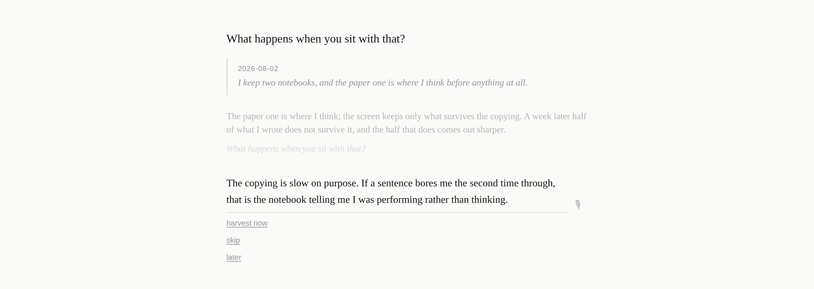

# Elicit

An interviewer that lives on your machine, asks you questions, and builds a
**human-shaped wiki** — a model of your beliefs, contradictions, knowledge, and
craft — out of nothing but your own verbatim words. Writing essays is one thing
that falls out of it. So is finding out what you actually think.

Every word in the corpus is yours. The agent contributes questions, placement,
and margin notes — never prose. That is not a style choice; it is the
architecture.

## Why this exists

Tools where an LLM writes and maintains a knowledge base share four failure
modes: the model smooths over contradictions until errors become internally
consistent; it synthesizes without citing; wrong claims become priors that
future generations build on; and when a contradiction is detected, nothing says
who resolves it. Elicit is the disciplined inverse of that pattern — the model
maintains what *you* wrote, because the act of writing is load-bearing:

| Failure mode | Elicit's answer, by construction |
|---|---|
| Smoothing / false coherence | Contradictions are first-class records, typed (real tension vs. "you changed"), never silently resolved |
| Uncited synthesis | Every wiki claim cites `snippet@version`; every snippet is a verbatim, code-verified substring of what you typed |
| Persistent errors | Snippet versions are immutable; transcripts are append-only; your edits are protected from the agent |
| No resolution authority | Only elicitation resolves — the agent may ask, never decide |

And one more, for a tool this personal: **every inference runs on your
hardware** — no hosted API, ever ([ADR-0001](docs/adr/0001-local-models-only.md)).

## How a sitting works



You open the app, say how much time and energy you have, and answer one
question at a time on a page that looks like a focus-mode markdown editor.
The agent probes with your own phrases ("what kind of *holding*?"), never
paraphrasing. When you harvest, it proposes cuts — exact substrings of what
you typed, checked in code; anything the model fabricates is dropped, never
patched. Approved cuts become dated, immutable snippets on disk, each with an
agent-written reading (what kind of person-knowledge it evidences) that lives
in the wiki layer, never inside your files.

Sessions build on each other: past snippets return as openers, and when
today's words repeat a phrase from something you wrote in March, both quotes
come back side by side as a question. What matches is the phrasing, not the
meaning. Resonance is a trigram index: a hit needs a verbatim run of three or
more words shared between the new text and the old snippet. So it catches
recurrence — the sentence you keep circling back to — and it misses the
belief you have restated in fresh words. If today's answer contradicts an old
snippet without reusing any of its language, nothing comes back. The channel
that would catch that is a local embedding index, staged to land with the
Clerk slice ([Q-17](docs/decisions/elicit.md)); until it does,
[`tests/resonance-paraphrase.test.ts`](tests/resonance-paraphrase.test.ts)
holds the paraphrase pairs it must start catching and records how many of
them resonance finds today, which is none.

You can also dictate: press the mic, speak, and the words land as editable
text. Elicit runs [Parakeet TDT](https://huggingface.co/csukuangfj/sherpa-onnx-nemo-parakeet-tdt-0.6b-v3-int8)
via [sherpa-onnx](https://github.com/k2-fsa/sherpa-onnx) in-process — the
model is ~600 MB of int8 ONNX, CPU-only, never leaves your machine. The
transcript appears in the answer field; you ratify or correct it before it
becomes part of the exchange. If the STT model isn't installed, dictation
simply isn't available — everything else works the same.

A sitting, in three screens:



*You declare the mode before anything else — 25 minutes, high energy, about myself.*



*One question at a time. When today's words repeat a phrase from an earlier sitting, that older quote comes back under the question, dated.*


*At harvest you re-read your own words. Each proposed cut is an exact substring of what you typed, carries the agent's reading, and is saved only if you approve it.*

The rest of the screens — the waiting surface with its queue and activity log,
and the exchange at phone width — are in [`docs/guide/`](docs/guide/). All of
them were captured against a running app with `ELICIT_LLM=fake`, so the
questions are scripted; everything else is the real interface.

## Status

Early and moving. The interview loop (slice 1) works end to end against a
local model. Slice 2 — resonance with your past snippets, a durable question
queue, a background clerk, domain interviews, the activity log — is in
progress. Resonance is lexical only so far, which is the deliberate first
half of Q-17; the embedding channel and the contradiction pipeline it feeds
(Q-30) are not built. The design is unusually well documented for the size of
the code; see [Design docs](#design-docs).

## Run it

Requirements: Node ≥ 20, and an OpenAI-compatible local model server
(llama.cpp, Ollama, LM Studio) reachable from this machine. For voice
input, the Parakeet STT model files (see below).

```bash
git clone <this-repo> elicit && cd elicit
npm install

# point it at your model server (defaults shown)
export ELICIT_LLM_BASE_URL="http://192.168.0.229:11434/v1"
export ELICIT_LLM_MODEL="qwen3.6:35b"

npm start
# open http://127.0.0.1:4517
```

On first run, Elicit shows a setup page — set a password there from the host
machine. The password is scrypt-hashed and written to `vault/.auth.json`
(mode 0600). There is no `ELICIT_PASSWORD` environment variable.

To make Elicit reachable from your phone or another machine on the LAN:

```bash
ELICIT_HOST=0.0.0.0 npm start
# open http://<host-ip>:4517 — lands on the login page
```

Setup is always gated to loopback: LAN visitors see a "finish setup from the
host machine" page until the password exists.

### Voice model

Dictation needs the Parakeet TDT int8 ONNX model files from HuggingFace:

```bash
# install the model into the cache directory Elicit checks by default:
huggingface-cli download csukuangfj/sherpa-onnx-nemo-parakeet-tdt-0.6b-v3-int8 \
  --local-dir ~/.omp/agent/cache/tiny-models/csukuangfj/sherpa-onnx-nemo-parakeet-tdt-0.6b-v3-int8
```

Or set `ELICIT_STT_MODEL_DIR` to any directory containing `encoder.int8.onnx`,
`decoder.int8.onnx`, `joiner.int8.onnx`, and `tokens.txt`. If the model isn't
found, voice input is disabled — no error, no crash.

## Configuration

| Variable | Default | What it does |
|---|---|---|
| `ELICIT_LLM` | `fake` | `local` = real model; `fake` = scripted responses for development |
| `ELICIT_LLM_BASE_URL` | `http://192.168.0.229:11434/v1` | OpenAI-compatible chat endpoint |
| `ELICIT_LLM_MODEL` | `qwen3.6:35b` | Model id at that endpoint |
| `ELICIT_VAULT_ROOT` | `./vault` | Where your corpus lives — plain markdown, portable, yours |
| `ELICIT_HOST` | `127.0.0.1` | Bind address; set to `0.0.0.0` for LAN access |
| `ELICIT_PORT` | `4517` | Port the server listens on |
| `ELICIT_STT_MODEL_DIR` | _auto-detected_ | Directory with Parakeet ONNX model files for voice input |

The question bank lives in `data/question-bank.jsonl` — curated opener
questions with provenance (mine are harvested from are.na channels via
`scripts/arena-question-bank.ts`). Grow it; the app picks up changes on
restart.

## The vault is yours

Everything persistent is markdown with frontmatter, readable without this
tool:

```
vault/
  snippets/<id>/v1.md     your words, verbatim, with provenance
  transcripts/<session>.md  append-only exchange records
  wiki/readings/<id>.md   agent readings, citing snippet@version
  buds/<id>.md            fragments not yet standalone, with their questions
  queue/<id>.md           pending questions (slice 2)
  .auth.json              scrypt password hash, 0600
```

If Elicit disappears tomorrow, your corpus opens in any editor. That is a
design requirement, not an accident.

## Interface philosophy

Every surface is a page of text. Controls exist only at the point of
attention, in the margin, on focus. The home surface is a dated page that
*says* what waits in sentences, not a dashboard of lists. Mode declaration is
a typed sentence ("10 quiet minutes, about myself"), not three dropdowns.
The Q&A screen is indistinguishable from a quiet writing app that happens to
ask questions. Harvest is re-reading your own words as continuous prose with
proposed cuts pre-underlined — keep by touching a span, trim by dragging its
edge. The wiki reads as a long essay in two inks: agent claims in light,
your quoted words in dark serif. There are no button rows, no status chips,
no alert boxes — typography carries the hierarchy, and color is reserved for
marginalia and contradiction flags. See
[`docs/interface-references.md`](docs/interface-references.md) for the full
lineage and the document rule that encodes this stance.

## Design docs

The domain model was designed by extended interrogation before code, and the
research is checked in:

- [`CONTEXT.md`](CONTEXT.md) — the glossary: every term, explicitly decided
- [`docs/decisions/elicit.md`](docs/decisions/elicit.md) — Q-1..Q-23, the
  constraint register every plan cites
- [`research-shape-of-the-problem.md`](research-shape-of-the-problem.md) —
  nine literatures on modeling a person from their own words
- [`research-question-policy.md`](research-question-policy.md) — ten
  literatures on which question to ask next, and when not to ask
- [`research-llm-wiki-gist.md`](research-llm-wiki-gist.md) — the LLM-wiki
  pattern's failure modes, mined from ~500 comments
- [`docs/backlog.md`](docs/backlog.md) — adopted mechanisms staged by slice
- [`docs/interface-references.md`](docs/interface-references.md) — the
  focus-friendly editor lineage the UI answers to

## Development

```bash
npm test              # vitest — the invariants live here
npm start             # local model, production build
npm run dev           # fake LLM, tsx watch (UI dev, no model required)
```

The tests are the contract: verbatim-substring enforcement, immutable
versions, append-only transcripts, no facet/stance keys in snippet files.
If you change behavior, a failing invariant test is the design telling you no.

## License

Not yet chosen — this is currently a personal tool. If you want to build on
it, open an issue first.
